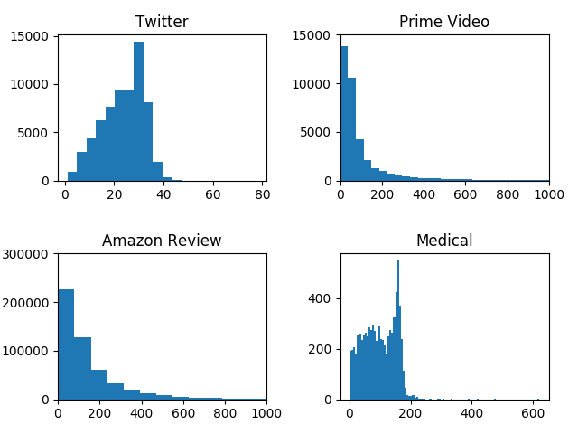

# Sentiment Analyse with Deeplearning using Tensorflow

## Datasets
- Amazon Prime Video (http://jmcauley.ucsd.edu/data/amazon/)
- Amazon Tech Review (http://jmcauley.ucsd.edu/data/amazon/)
- Medical Dataset (data/medical/WebGrabber.py)
- Twitter (http://cs.stanford.edu/people/alecmgo/trainingandtestdata.zip) & 
(http://alt.qcri.org/semeval2017/task4/data/uploads/download.zip)

### Die Anzahl der Wörter im Datensatz:

## Embedding
Es wurde ein Glove Embedding benutzt, welches mit Twitter trainiert worden ist  

https://nlp.stanford.edu/projects/glove/

## Neural Networks
1. Convolutional Neural Networks (CNNs)

2. Long Short Time Memory (LSTM)

